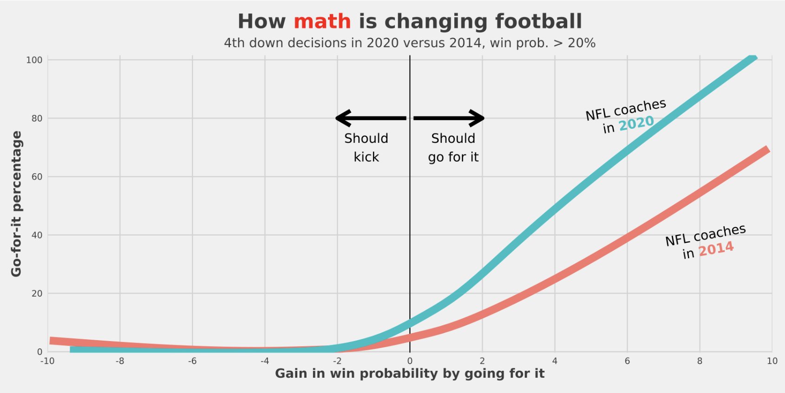

```{r setup, include=FALSE}
knitr::opts_chunk$set(echo = TRUE)
```

<h1 style="text-align: center; font-size:20pt">

<!-- Everything you need to know to use **The Book**! -->

<div align="center" style="margin-top: 20px;">
  <a href="https://bit.ly/split-zone-analytics" target="_blank" style="font-size: 18px; color: #0366d6; text-decoration: none;">Read the Paper</a>
</div>
</h1>


<h2 style="font-size:16pt">

**Example Use Case of The Book**

</h2>

*Video*

<div align="center">
  <a href="https://www.youtube.com/watch?v=EysyNzu0tno" target="_blank"></a>
</div>

*Sheet From The Book*

```{r, echo=FALSE}

```

- How to use a *The Book*
  1) Locate the sheet according to the game situation (ex : 4th Quarter, 7 - 4 minutes left, Losing by 3 to tied)
  2) Find the bin on the x-axis (Yardline Bins) that contains the current line of scrimmage
  3) Find the yards to go on the y-axis (Yards to Go) that corresponds the current yards to go
  4) Identify the color of the bin and advise the coach to go for it (brighter green), or not go for it (darker blue), or go with their gut (white)


<h2 style="font-size:16pt">


**How Analytics Have Changed The Game**

</h2>

```{r, echo=FALSE}

```


<h2 style="font-size:16pt">

**General Outline of Work**

</h2>

- Model Building Scripts and Code
  1) nflfastR_data_acquisition_cleaning_prep.Rmd
      * This file should be run first, very generally it pulls the data from nflfastR and preps it for xgboost tuning / modeling
      * Does this through a variaty of data cleaning and variable creation methods
      * Ultimately returns a data frame with the data in a format where I can plug it into the necessary the xgboost tuning / modeling
  2) XGBoost nflfastR 4th.Rmd
      * This file should be run second, takes the data from above and tunes the xgboost model and allowed me to specify hyperparameters
      * Ultimately returns two xgboost models (eta 05 and 1 - ultimately went forward wiht the eta of 05)
  3) Actual Test Predictions 05 eta vs. 1 eta categorical time and categorical score diff and cumulative categorical yardline 100 and quant yardline 100.R
      * This file takes the model and the partitioned data and makes predictions on the test set
      * It also compares the two eta models and their predictions but in reality, I saved the predictions it made in the middle of it before comparing the two for the next file
      * Ultimately compares the predictions through a few various visuals but saves a data frame with the predictions and some undummied columns for analysis in the future
  4) Model Evaluation.R
      * This file is not necessary and just again looks at the SHAP in a file with less junk in
      * Ultimately just saves the SHAP plots
  5) Prediction Clean Up.R
      * This file was also just an exploratory files to sort of play around and explore with the coach risk aversion adjustment and see how that effects the predicitions
      * Ultimately just prints out some plots and doesn't save anything for the future
- Game Prediction
  1) Pull and Set Up Data.Rmd
      * This file is almost identification to nflfastR_data_acquisition_cleaning_prep.Rmd but just is able to pull the most up to date nflfastR data and save it in a different location than the training / test data from nflfastR_data_acquisition_cleaning_prep.Rmd
      * Ultimately saves the same data frame as above with all clean data & created variables but just has most up to date information
  2) Expand Grid Prediction Set Up.R
      * This file takes the data from above and creates all reasonable (situations that can physically happen - non-impossible situations)
        * These combinations include all possible combinations of yard line (both quantitative and categorical), score differential (categoriccal), game time remaining (categorical), input play type
      * Ultimately saves a data frame of all those possible combinations for those inputs
  3) Specific Game and Team Information Set Up.R
      * This file takes that expanded grid / data frame and merges on the game specific information (ex : weather, ELO's, EPA's, etc)
      * Ultimately this saves the now game specific data frame that will be used to make predictions
  4) Specific Game Predictions Creation.R
      * This file takes the specific game and team information data frame and make predictions for WPA for each play type
      * Ultimately this saves the predictions as an additional column for each row so we have all that went into the predicition and the prediction
  5) Specific Game Predictions Adjustment.R
      * This file takes those predictions above and adds a base risk adjustment factor for field goal and punt plays and an additional base punt risk adjusment, this is based on the difference in predictions
      * It also has a risk adjustment input from the coach who can choose a number from 0 to 1 that control how risk averse he wants to be advised (where 1 is very conservative and 0 is very risky)
      * Ultimately this saves a similar file to the one above just with the coach specific adjustments
  6) Specific Game Predictions Tile.R
      * This file creates the 4 types of plots for the different ways a coach could view the predictions
      * Ultimately this file saves the 72 combinations of the predictions based off the game situation in 4 seperate folders by which visual the coach would want to look at